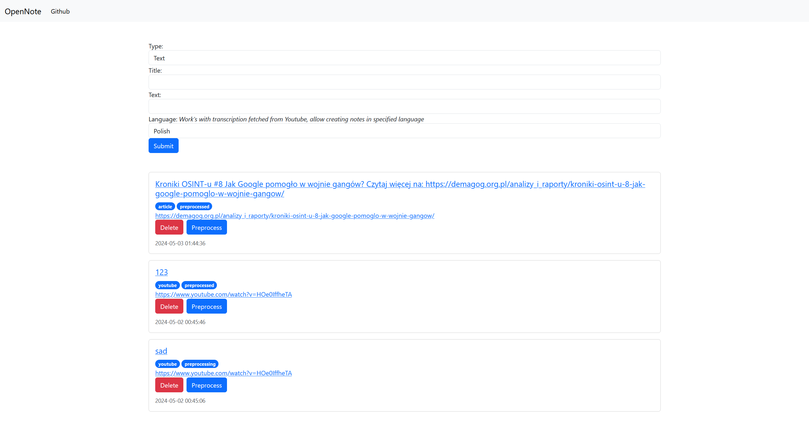

[![Contributors][contributors-shield]][contributors-url]
[![Forks][forks-shield]][forks-url]
[![Stargazers][stars-shield]][stars-url]
[![Issues][issues-shield]][issues-url]
[![MIT License][license-shield]][license-url]
[![LinkedIn][linkedin-shield]][linkedin-url]


<br />
<div align="center">
  <h3 align="center">OpenNote</h3>
  <strong align="center">
    OpenNote allows you to process files, videos and articles and create notes/summaries with just a few clicks. The whole app is supported by local AI models.
    <br />
    <br />
    <a href="https://github.com/DEENUU1/OpenNote/issues">Report Bug</a>
    ·
    <a href="https://github.com/DEENUU1/OpenNote/issues">Request Feature</a>
  </strong>
</div>




## About the project

### Main Idea 
The goal of this project was to make learning new things easier. The program was created for my own use, but I provide it with full support in the future.

This project allows you to create notes or summarize using LOCAL artificial intelligence models. The program does not require a penny to run (unless we are talking about a slightly better computer)

The user can enter text manually, provide a link to an article, a YouTube video or a file in .PDF or .TXT format

Then, after initial data processing, the program allows you to create notes/summaries using artificial intelligence.

### Preprocessing


As I mentioned, the project allows you to provide various data sources. I will try to briefly discuss each of them.

#### Text input
Here, the user can manually enter the text that he would like to process

#### Online article
Thanks to the Selenium framework and page content parsing, it is enough to provide a link to any article on the Internet and the program will automatically download the entire page content and then save all the text contained in the h1, h2, h3, h4, h5 and p

#### Youtube video
In this case, two solutions were used.
First, the program checks whether subtitles have already been added manually or generated for this film. Most videos have subtitles turned on, but there are some without them. Then the program automatically downloads the movie as an .mp3 file and then divides it into parts - 2.5 minutes each.
Then, using the Whisper model, which also works locally and does not require any costs, it creates a transcription of the entire video.

#### PDF, TXT file
Here the principle of operation is similar to `Text input`, the file is saved and then it is parsed to extract all the text from it

### Process

Processing involves loading previous data and then dividing it into parts so that they fit into the context of the language model. Then, a note/summary is created for each of these parts.
Once all the parts have been processed, they are combined and saved to the database.

Everything is done by using artificial intelligence models that run locally on the computer.

## Technologies:
- Python
    - FastAPI
    - Selenium
    - Beautiful Soup 4
- SQLite
- Docker
- Javascript
- HTML, CSS, Bootstrap
- Powershell
- Ollama
- Whisper 
- OpenAI
- Groq

## Installation

### Clone repository
```bash
git clone https://github.com/DEENUU1/property-aggregator.git
```

### Create .env file
```bash
cp .env_example .env
```

#### How to set up AI models in .env file
`LLM_MODEL` (OPTIONAL) If you want to use Ollama here you can select one of model from this list https://ollama.com/library (codegemma, gemma, llama2, mistral, ...) <br><br>
`OPENAI_APIKEY` (OPTIONAL) If you want to use OpenAI with models (GPT4/GPT3.5-Turbo) here you can add your API KEY <br><br>
`GROQ_APIKEY` (OPTIONAL) If you want to use GROQ API with models (Llama3/Llama2 etc.) here you can add API KEY <br><br>
`WHISPER_MODEL` (OPTIONAL)  here you can select one of model from this list https://github.com/openai/whisper (tiny, base, small, medium, large) <br>

### (OPTIONAL)  Install FFmpeg on your machine
It's available on Windows, MacOS and Linux
https://ffmpeg.org/download.html

### (OPTIONAL)  Install Ollama to manage LLM models
https://ollama.com/


### Option 1 - Run app by using Docker
```bash
# Build Docker image
docker build -t app .

# Run container
docker run app
```

### Option 2 - Run app with Powershell script
This is a great option if you are using Windows.
Right click on `run.ps1` file and click `Run With Powershell`


### Option 3 - Run with command 
```bash
pip install -r requirements.txt

cd ./src

python app.py
```

## Authors

- [@DEENUU1](https://www.github.com/DEENUU1)

<!-- LICENSE -->

## License

See `LICENSE.txt` for more information.


<!-- MARKDOWN LINKS & IMAGES -->
<!-- https://www.markdownguide.org/basic-syntax/#reference-style-links -->

[contributors-shield]: https://img.shields.io/github/contributors/DEENUU1/OpenNote.svg?style=for-the-badge

[contributors-url]: https://github.com/DEENUU1/OpenNote/graphs/contributors

[forks-shield]: https://img.shields.io/github/forks/DEENUU1/OpenNote.svg?style=for-the-badge

[forks-url]: https://github.com/DEENUU1/OpenNote/network/members

[stars-shield]: https://img.shields.io/github/stars/DEENUU1/OpenNote.svg?style=for-the-badge

[stars-url]: https://github.com/DEENUU1/OpenNote/stargazers

[issues-shield]: https://img.shields.io/github/issues/DEENUU1/OpenNote.svg?style=for-the-badge

[issues-url]: https://github.com/DEENUU1/OpenNote/issues

[license-shield]: https://img.shields.io/github/license/DEENUU1/OpenNote.svg?style=for-the-badge

[license-url]: https://github.com/DEENUU1/OpenNote/blob/master/LICENSE.txt

[linkedin-shield]: https://img.shields.io/badge/-LinkedIn-black.svg?style=for-the-badge&logo=linkedin&colorB=555

[linkedin-url]: https://linkedin.com/in/kacper-wlodarczyk

[basic]: https://github.com/DEENUU1/OpenNote/blob/main/assets/v1_2/basic.gif?raw=true

[full]: https://github.com/DEENUU1/OpenNote/blob/main/assets/v1_2/full.gif?raw=true

[search]: https://github.com/DEENUU1/OpenNote/blob/main/assets/v1_2/search.gif?raw=true
